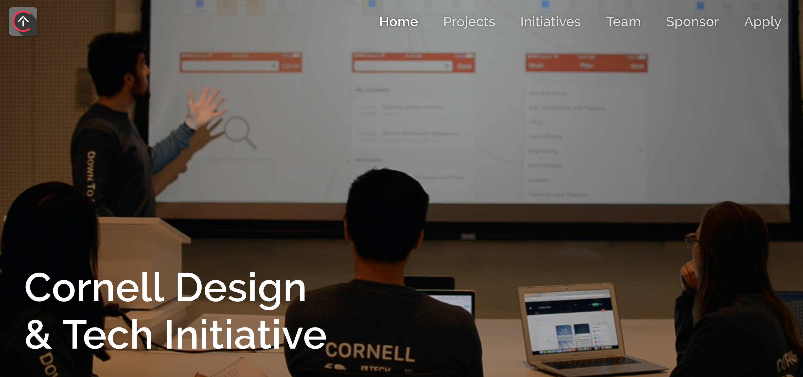
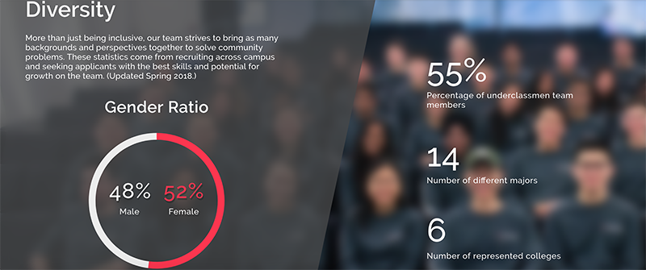
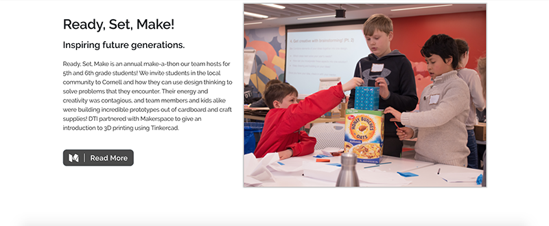

# Cornell DTI Website

_Last updated **10/01/2019**_.
​
#### Contents
  - [About](#about)
  - [Getting Started](#getting-started)
  - [Dependencies & Libraries](#dependencies--libraries)
  - [External Documentation](#external-documentation)
  - [Screenshots](#screenshots)
  - [Contributors](#contributors)
​
## About
A web app for informing the general public about the Cornell Design & Tech Initiative project team, our goals, our projects, our initiatives, and how you can support us. **[https://www.cornelldti.org](https://www.cornelldti.org)**.
​
## Getting Started
You will need **a text editor (VS Code, Atom, Brackets, Webstorm)** to run the latest version of this app, which uses the following **packages**:
​
 * Node.js v12.x
 * NPM version 6.x
 * Yarn version >= 1.13.x

### Directory Structure
The entire site is built with Vue.js utilizing single page components comprising of JavaScript, SCSS, and Vue HTML templates.

- static: _all files which need to be served on / go here_
  - static: _all files which need to be served on /static/ go here_
    - branding: _all global branding assets go here_
    - pages: _assets for particular pages live here_
- data: _contains all string-based data which will be used for the website_
- src: _all dynamic files live here_
  - index.html: the base template for the entire site.
  - assets:  _primarily hosts SVGs which will be inlined in our build system and image files that will be compressed_
  - components:  _all Vue components which will be used across multiple page components_
  - [strings]: strings library
  - eventbus: _an instance of [Vue] which is utilized as a global eventbus._
  - pages: _Vue components that comprise entire pages on the site._
    - projects: _Page components for specific projects_
  - scss: _All global CSS_
    - bootstrap-custom _All overrides of bootstrap defaults live here_
  - App.vue: _The Vue components that other components will be injected into_
  - index.scss: _Imports all SCSS into the app_
  - main.ts: _The application entry point, initializes Vue.js_

### Build Setup
``` bash
# install dependencies
yarn

# build for production with minification
yarn build
```

### Deploy Setup

Our `master` branch automatically deploys to our Netlify staging instance.
​
## Dependencies & Libraries
 * [Vue](https://vuejs.org) 2.6.x - A JavaScript front-end framework for building component-driven web applications. Vue offers a flexible, strong developer framework that is more well structured and powerful than Angular, and has a better learning curve than React. 

 * [Express](https://expressjs.com) 4.16.x+ - A back-end library that implements a web server for our back-end. We use it to route initial requests to our front-end (Vue).

 * [Bootstrap](https://bootstrap-vue.js.org) 2.0 - An implementation of Bootstrap that provides developers with a comprehensive set of components and integrations with Vue.

 * [Webpack](https://webpack.js.org) 4.1.0+ -  A module bundler that manages dependency usage, compression of CSS & JavaScript code, compilation of Vue to JavaScript, and management of assets.

 * [Heroku CLI](https://devcenter.heroku.com/articles/heroku-cli) - A command-line tool for deploying applications to Heroku.
​
## Screenshots
​



​
## Contributors
​
**2019**
 * **Evan Welsh** - Product Manager
 * **Will Spencer** - Frontend Developer
 * **Andrew Yates** - Backend Developer
 * **Kathleen Xu** - Business Represenative + Developer/Designer
 * **Sanjana Seshadri** - Designer
 * **Ishika Jain** - Designer

**2018**
 * **Alice Pham** - Product Manager
 * **Evan Welsh** - Developer
 * **Kathleen Xu** - Business Analyst
 * **Matt Barker** - Designer
 * **Shea Belsky** - Developer
 * **Wenchang Yang** - Designer
 * **Yvonne Chan** - Developer

 **2017**
 * **Alice Pham** - Product Manager, Developer
 * **Alice Zhou** - Developer
 * **David Chu** - Developer
 * **Karun Singh** - Developer
 * **Matt Barker** - Designer, Developer

​
We are a team within **Cornell Design & Tech Initiative**. For more information, see our website [here](https://cornelldti.org/).

​
